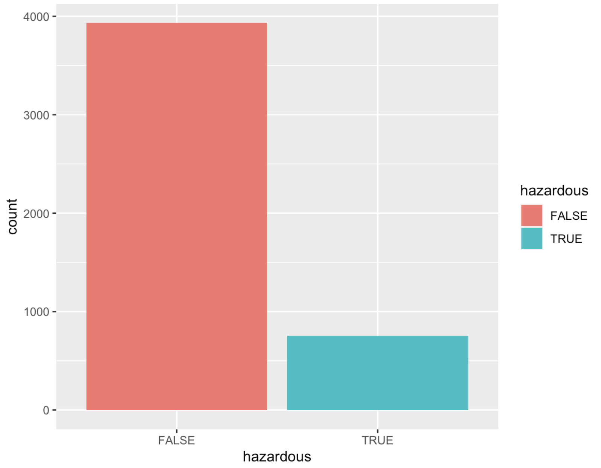
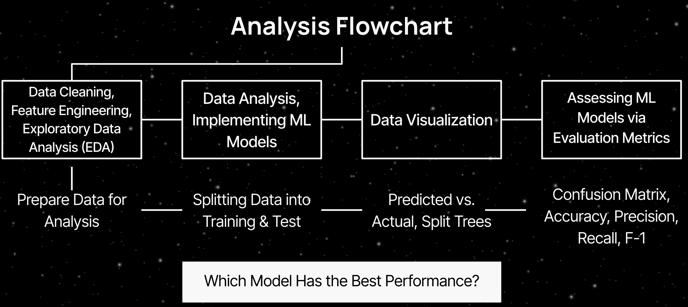
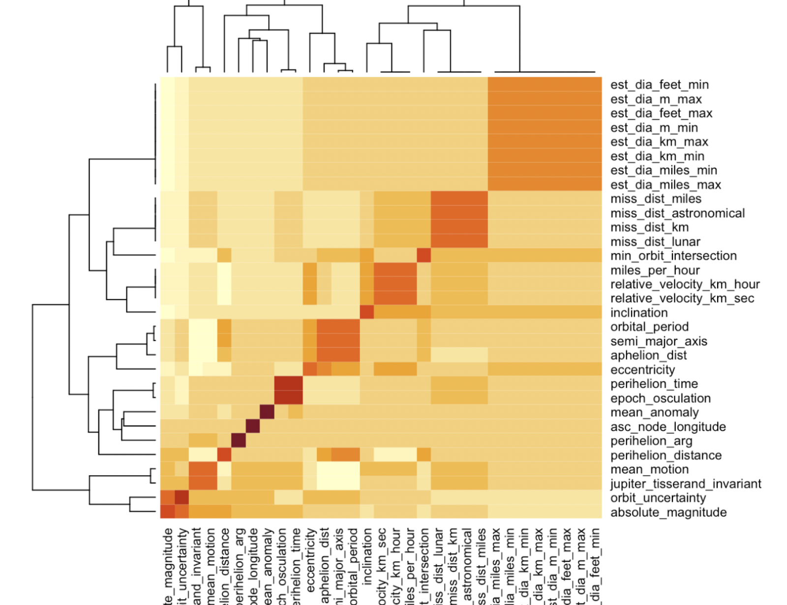
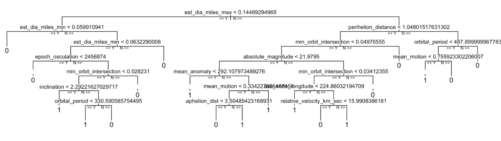
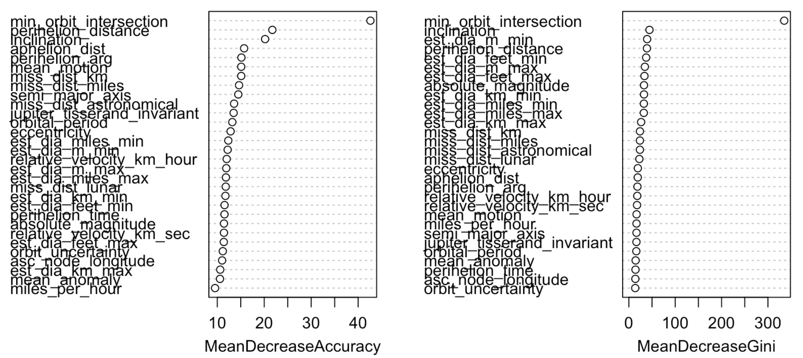
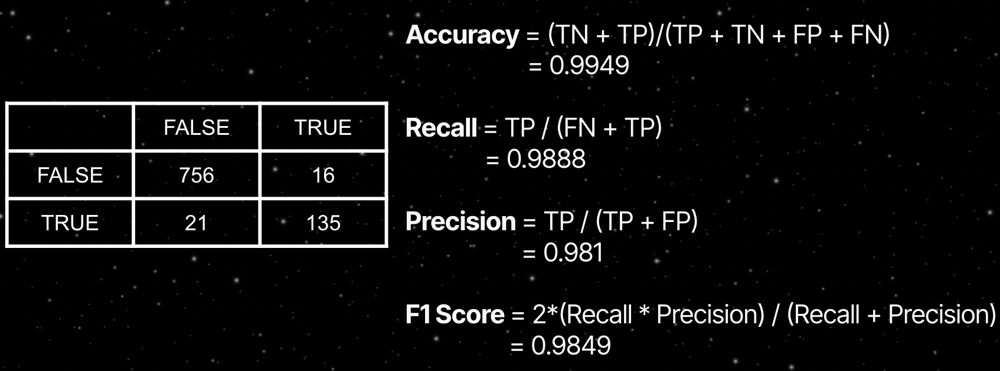
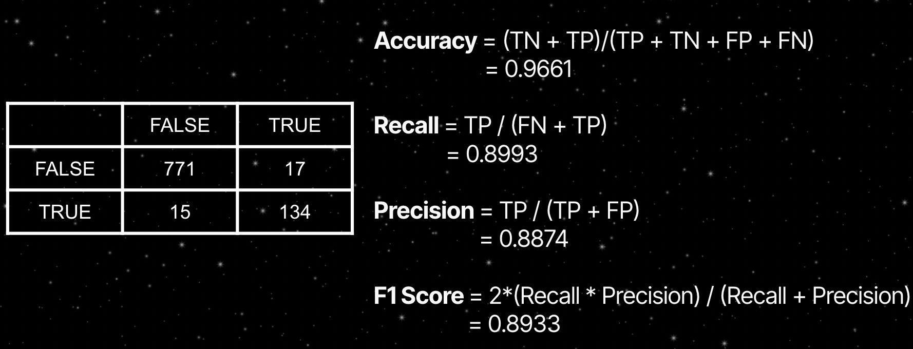
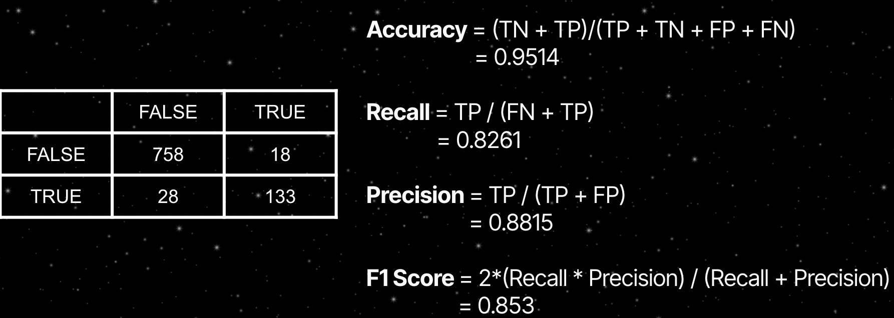

# Classifying Hazardous Asteroids with Machine Learning

In this project, I developed three different Machine Learning Models (Random Forests Support Vector Machine (SVM), and Naive Bayes) to classify potentially hazardous asteroids using the [NASA Asteroids dataset](http://neo.jpl.nasa.gov/). I also compared these three models using evaluation metrics from the confusion matrix - accuracy, precision, recall, and F1, to see which model was the best at accurately predicting hazardous asteroids. This project was coded in R/RStudio and a copy of the code can be found [here](https://github.com/yujinahn02/asteroids/blob/main/asteroids_r_code.R).

## Dataset
The asteroids classification dataset was published in 2018 by NASA, and includes information on 4687 different asteroids and 40 characteristics that describe them, such as their distance to the earth and relative velocity. I had two types of variables, numerical and categorical. My target output variable was the “hazardous” column, which included values of TRUE and FALSE. After creating a boxplot of my target variable, I realized I had an imbalanced class.  My target variable is an imbalanced class, which means that there are significantly more asteroids classified as non-hazardous than hazardous. This was important to remember because it means the baseline accuracy is 84%, ***which means that even if I create a completely incorrect model, it will still accurately predict hazardous asteroids 84% of the time***. As a result, I kept this in mind when evaluating my model using evaluation metrics, reminding myself that accuracy alone cannot be used to evaluate my model's performance.

## Methodology
When I decided to complete this project, I realized very early on that it would be a lengthy one, and thus, I should create a detailed roadmap on how I was going to complete it. My general plan was to follow the analysis flowchart below, to ultimately create three different ML models and assess them using various evaluation metrics to determine which one was the best at classifying potential hazardous asteroids.   

## Data Preprocessing
Preparing data for analysis always takes up the most, and it was no different for this project. I reviewed the structure of my data - the number of rows and columns, summary statistics - and ensured that there were no missing values. Performing Exploratory Data Anlysis (EDA) allowed me to see the underlying relationships between the data, preventing surprises later on. Many of my columns also contained spaces and capital letters, so I manually converted them to lowercase and replaced the spaces with underscores after discovering, through trial and error, that the randomforest() function does not recognize them.
I then used feature engineering to remove columns that were unnecessary in determining whether an asteroid is hazardous or not. Finally, I explored my target variable as shown in the bar plot before and found out it had a logical, binary form.  

To emphasize my feature engineering, I created a correlation matrix, and then a plot to highlight redundancy within the data. As you can see, est_dia_feet_min, est_dia_feet_max, est_dia_km_max, and est_dia_miles_max had a correlation of 1, meaning that they represented the same values but in different units of measurement. I removed all of these and kept just one to remove redundancy.  .

## Model 1: Random Forests
The first model I created was a random forest model. It is a supervised machine learning method that builds multiple decision trees during training and can be used for both regression and classification. In my model, I created 500 trees to match my 4,000 something observations, and got the following tree split:  As you can see, there are many different splits in my model. The 1s represent asteroids classified as hazardous, while the 0s represent those that are not.  

A helpful output from creating a random forest model is the fact that I was able to derive which variables were the most significant in predicting whether or not an asteroid is potentially hazardous. Below are two graphs: Mean Decrease Accuracy and Mean Decrease Gini. 

The "Mean Decrease Gini" in feature importance from a Random Forest model measures the average decrease in Gini impurity achieved by each feature across all decision trees in the forest, reflecting how important each feature is for splitting nodes and improving purity. On the other hand, "Mean Decrease Accuracy" assesses the impact of excluding each feature on the model's overall accuracy, quantifying the contribution of each feature to the predictive performance of the Random Forest by evaluating the reduction in accuracy when the feature is excluded.
*Min_orbit_intersection, inclination, est_dia_m_min, and perihelion_distance* seem to be the features that are the most significant, and are therefore critical in predicting asteroid hazard due to their direct influence on orbital dynamics and physical characteristics. They indicate proximity to Earth's orbit, orbital inclination relative to the ecliptic, size-related impact potential, and orbital proximity to the sun, respectively, all of which contribute significantly to the classification of potentially hazardous asteroids.  
### Evaluating Model 1 Using Evaluation Metrics

After computing the confusion matrix, I calculated an accuracy of 99.49%, recall of 98.88%, precision of 98.1% and f1 score of 98.49%. This means that this model was able to accurately predict the classes 99.49% of the time. Seems good at first - but we have to remember that our dataset is imbalanced and we cant solely rely on accuracy to determine model performance. I’ll get back to this later when I compare the three models.

## Model 2: Support Vector Machines (SVM)
Let’s take a look at another model, Support Vector Machines, a supervised machine learning model used for classification and regression, that separates the classes by maximizing a hyperplane between them.

### Evaluating Model 2 Using Evaluation Metrics

From the confusion matrix, I calculated an accuracy of 96.6%, recall of 89.9%,precision of 88.7% and 89.33%. This model was worse at correctly predicting classes compared to our random forest model. 

## Model 3: Naive Bayes
My final model is a naive bayes model, a probabilistic machine learning model that applies bayes’ theorem and classifies instances based on their maximum likelihood of belonging to a particular class.

### Evaluating Model 3 Using Evaluation Metrics

From this confusion matrix, I computed an accuracy of 95.14%, recall of 82.61%, precision of 88.15%, and f1 score of 85.3%. A recall of  82.61%  implies that the model captures a substantial portion (about 82.61%) of the actual hazardous asteroids. All four metrics of this model are lower than those of the previous two models. But what does this mean in the context of correctly classifying hazardous asteroids?

## Comparing the Three Models
I plotted a comparison of my three machine learning models' performance and evaluation metrics. Random Forests outperformed all four metrics, followed by SVM and Naive Bayes.
When deciding which model was "best," I had to consider the meaning of these evaluation metrics in terms of their real-world applications. Accuracy is defined as the proportion of correctly classified instances (both hazardous and non-hazardous); recall is defined as the proportion of true hazardous asteroids among all asteroids predicted to be hazardous; f1 is The harmonic mean of precision and recall is Precision measures the model's ability to make positive predictions (hazardous asteroids) with accuracy.
In our case, accidentally misclassifying a hazardous asteroid as non-hazardous (FN) has serious consequences. As a result, I focused heavily on which model had the highest recall - my model's ability to correctly identify all hazardous asteroids in the dataset. High recall ensures that a greater proportion of actual hazardous asteroids are detected and classified correctly, reducing the possibility of missing potentially dangerous objects.  
  After considering the aforementioned criteria, I determined that Random Forests was the best performer, with the highest recall, f1, and accuracy. A recall of 98.8% indicates that it performed exceptionally well in correctly predicting hazardous asteroids that were actually classified as hazardous, while minimizing false negatives, which occur when a hazardous asteroid is incorrectly classified as non-hazardous. Maximizing recall reduces the occurrence of false negatives, which is critical for planetary defense and risk mitigation, and may jeopardize the earth's safety. It also had a high f1 of 98.5%, indicating a good balance between accurately identifying hazardous asteroids and minimizing false alarms. Finally, it had a high accuracy of 99.5, which alone cannot be used to evaluate this model because our dataset was imbalanced, but when combined with the other two metrics, it demonstrates its ability to effectively classify hazardous asteroids.

## Conclusion
Random Forests performed best as they are effective at capturing complex non-linear relationships between features and the target variable. This flexibility allows them to better model the diverse characteristics of hazardous asteroids, which may exhibit intricate patterns that are not easily captured by linear or probabilistic methods like Naive Bayes or SVM.

